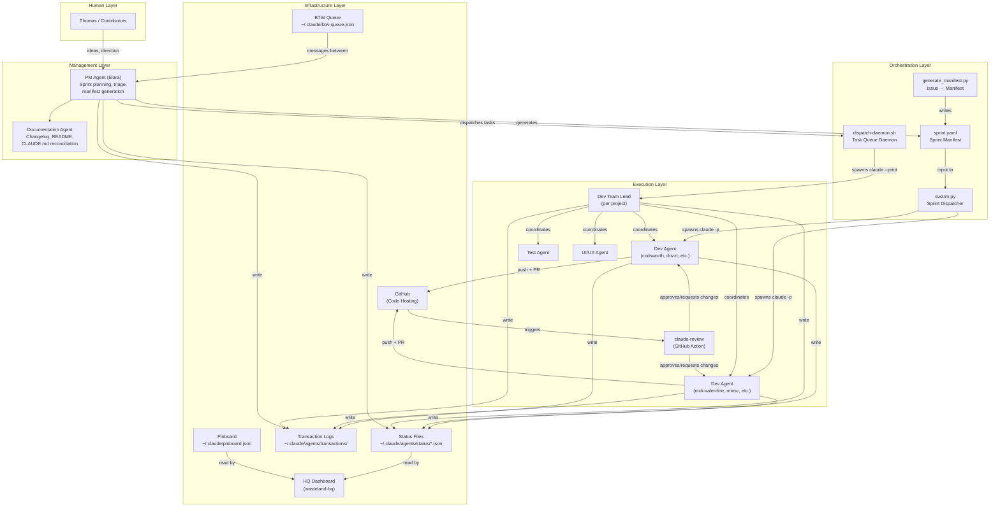
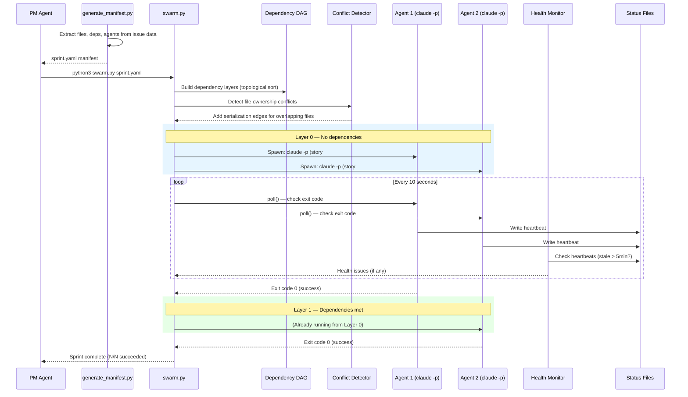
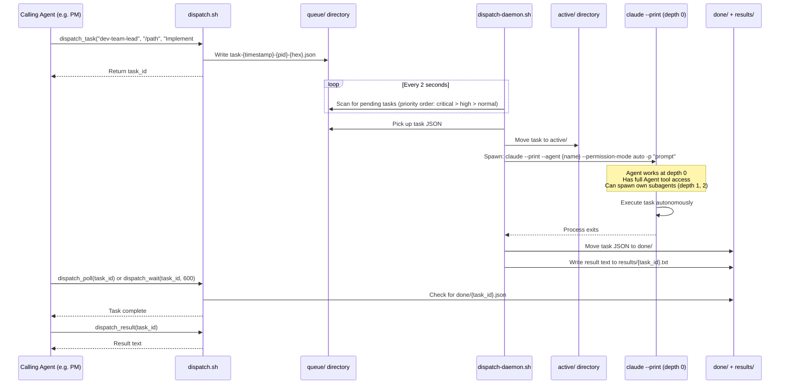
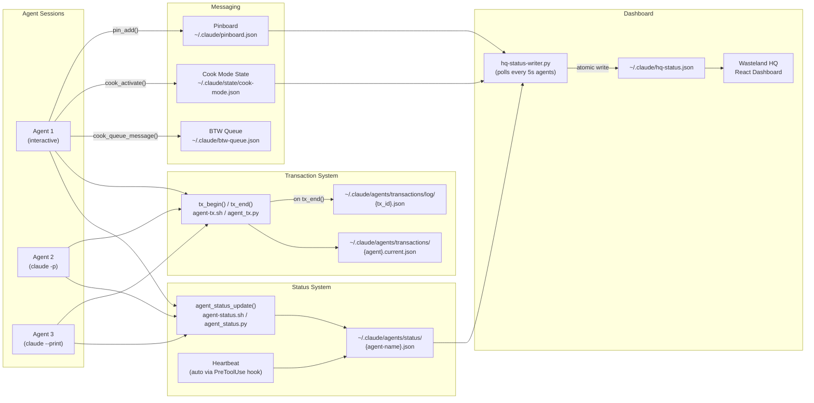
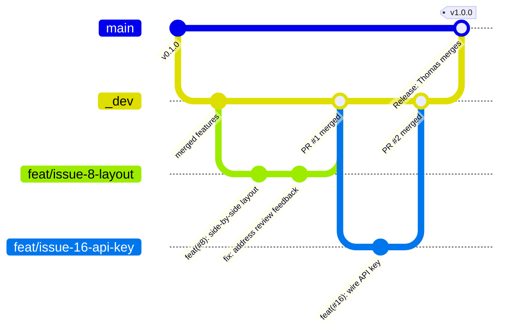
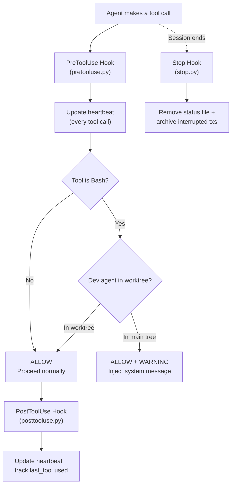
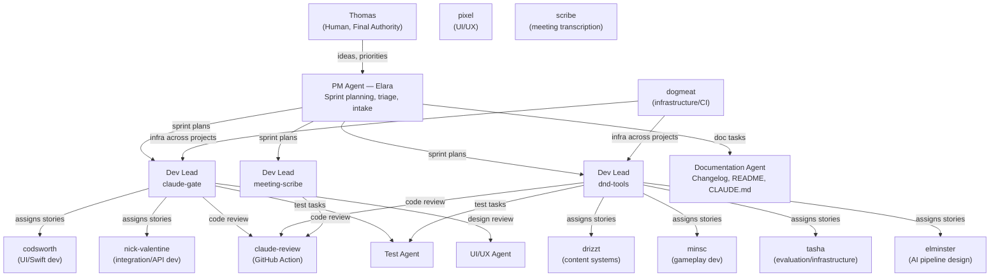

# Wasteland Orchestrator

A Claude Code plugin for multi-agent orchestration: status reporting, transactions, team coordination, and real-time dashboard for AI agent workflows.

## What It Does

- **Agent Status Tracking** — Every agent reports what it's doing in real-time via structured status files
- **Ceremony Automation** — Hooks automatically orchestrate agent initialization (spawn setup, heartbeat, status registration)
- **Transaction System** — Groups related actions into auditable units with stated intent and justification
- **Protocol Enforcement** — PreToolUse hooks verify agents follow conventions (worktree isolation, etc.)
- **Sprint Dispatch** — Automated swarm dispatcher reads sprint manifests and spawns parallel `claude -p` agents
- **Dashboard Ready** — Status files and transaction logs feed terminal dashboards and the HQ visual dashboard

## Architecture

### System Overview

The orchestrator sits at the center of a multi-layer agent system. Thomas (human) directs a PM agent, who plans sprints and dispatches work to dev agents via the orchestrator.



### Task Dispatch Flow

There are two dispatch mechanisms: the **swarm dispatcher** for full sprint execution, and the **dispatch daemon** for ad-hoc task delegation.

#### Swarm Dispatcher (Sprint Execution)



#### Dispatch Daemon (Ad-hoc Task Queue)



### Project Structure

```
wasteland-orchestrator/
  .claude-plugin/
    plugin.json          # Plugin manifest
  hooks/
    hooks.json           # Hook registration
    pretooluse.py        # PreToolUse: heartbeat, worktree checks
    posttooluse.py       # PostToolUse: heartbeat, tool tracking
    stop.py              # Stop: cleanup status, archive interrupted transactions
  lib/
    agent_status.sh      # Agent status reporting (shell wrapper)
    agent_status.py      # Agent status reporting (Python)
    agent_tx.sh          # Transaction system (shell wrapper)
    agent_tx.py          # Transaction system (Python)
  tools/
    ww-json-tool.py      # JSON processing utility for agent workflows
  skills/
    agent-protocol/
      SKILL.md           # Mandatory protocol documentation
  commands/
    status.md            # /status slash command
    tx.md                # /tx slash command
  docs/
    VOCABULARY.md        # Agent protocol terminology guide
    ARCHITECTURE.md      # System design and data flow diagrams
```

### Agent Communication & Status

Agents communicate through file-based systems. No sockets, no message queues — just JSON files on disk.



### Git Workflow

All code changes flow through feature branches, pull requests, and automated review.



**Branch rules:**
- `main` — production, only Thomas merges here
- `_dev` — integration branch, dev-lead may merge feature PRs here
- `feat/issue-N-*` — feature branches, one per story, target `_dev`
- Agents **never** commit directly to `main` or `_dev`

**PR lifecycle:**
1. Agent creates `feat/issue-N-*` branch from `_dev`
2. Agent pushes to GitHub and creates PR targeting `_dev`
3. `claude-review` GitHub Action runs automated code review
4. Agent addresses review feedback, pushes fixes
5. Once review passes, dev-lead merges PR into `_dev`
6. For releases: PM creates `_dev` → `main` PR, Thomas reviews and merges

### Hook Enforcement

The plugin uses Claude Code hooks to enforce protocol compliance at the tool-call level.



### Chain of Command



**Idea flow:** Thomas's raw ideas → PM triages → issue created → manifest generated → dispatcher spawns agents → agents implement → PR reviewed → merged to `_dev` → PM creates release PR → Thomas merges to `main`.

## Component Reference

### Core Orchestrator

| File | Description |
|------|-------------|
| `swarm.py` | Sprint dispatcher — reads manifest, builds DAG, spawns `claude -p` agents, monitors health |
| `generate_manifest.py` | Provides helper functions for parsing issues into `sprint.yaml` manifests |
| `sprint.yaml` | Sprint manifest — stories, agents, dependencies, max parallelism |

### Plugin Infrastructure

| File | Description |
|------|-------------|
| `.claude-plugin/plugin.json` | Claude Code plugin manifest (name, version, metadata) |
| `hooks/hooks.json` | Hook registration — maps PreToolUse, PostToolUse, Stop to Python scripts |
| `hooks/pretooluse.py` | PreToolUse hook — heartbeat, worktree checks |
| `hooks/posttooluse.py` | PostToolUse hook — heartbeat update, last-tool tracking |
| `hooks/stop.py` | Stop hook — cleanup status file, archive interrupted transactions |

### Python Libraries (`lib/`)

| File | Description |
|------|-------------|
| `lib/manifest.py` | `SprintManifest` and `Story` dataclasses, YAML parser, topological sort |
| `lib/agent_status.py` | `AgentStatus` class for reading/writing status JSON files |
| `lib/agent_tx.py` | `Transaction` class for begin/action/end with JSON persistence |
| `lib/conflict.py` | File ownership graph — detects overlapping stories, adds serialization edges |
| `lib/monitor.py` | `HealthMonitor` — heartbeat checks, stall detection, auto-restart of failed agents |

### Shell Libraries (`~/.claude/lib/`)

| File | Description |
|------|-------------|
| `agent-status.sh` | `agent_status_update`, `agent_status_heartbeat`, `agent_status_clear`, `agent_status_list` |
| `agent-tx.sh` | `tx_begin`, `tx_action`, `tx_end`, `tx_current`, `tx_recent` |
| `dispatch.sh` | `dispatch_task`, `dispatch_poll`, `dispatch_wait`, `dispatch_result`, `dispatch_status` |
| `cook.sh` | `cook_activate`, `cook_deactivate`, `cook_queue_message`, `cook_check_exit`, `cook_is_active` |
| `btw.sh` | `btw_check`, `btw_count`, `btw_read`, `btw_process_all` — background message queue |
| `pinboard.sh` | `pin_add`, `pin_list`, `pin_done`, `pin_remove`, `pin_update` — persistent cross-session notes |

### Daemon & Dashboard

| File | Description |
|------|-------------|
| `~/.claude/bin/dispatch-daemon.sh` | Standalone daemon — watches queue/, spawns `claude --print`, manages lifecycle |
| `~/.claude/bin/hq-status-writer.py` | Polls status files, writes `hq-status.json` for the React dashboard |

### Slash Commands

| Command | Description |
|---------|-------------|
| `/status` | Show all agent states, active transactions, stale/dead detection |
| `/tx` | Transaction management — `begin`, `action`, `end`, `current`, `recent` |
| `/cook` | Activate autonomous work mode — user messages queued, not interrupting |
| `/uncook` | Exit cook mode — show queued message summary |

### Skills

| Skill | Description |
|-------|-------------|
| `agent-protocol` | Mandatory protocol spec — status reporting, worktrees, transactions, commits |

## Protocol Overview

All agents must:
1. Report status via `agent_status_update` (hooks handle heartbeat automatically)
2. Wrap work in transactions with intent/justification
3. Work in git worktrees (dev agents only, enforced by hooks)
4. Update persona files with learnings after each session

See `skills/agent-protocol/SKILL.md` for the full protocol specification.

## Documentation

- **VOCABULARY.md** — Terminology guide for agent roles, states, and workflow concepts
- **ARCHITECTURE.md** — Visual system design including agent initialization flow and transaction lifecycle
- **Ceremony Automation** — Hooks automatically initialize agents with proper status tracking and spawn handling

## Agent States

| State | Meaning |
|-------|---------|
| idle | No active task |
| working | Actively on a task |
| reviewing | Reviewing code/PR |
| brainstorming | Design session |
| meeting | Meeting scribe live |
| blocked | Waiting on dependency |

## Installation

### As a Claude Code Plugin
```bash
# From the Claude Code CLI
claude plugin add wasteland-orchestrator
```

### Manual
```bash
git clone https://github.com/severeon/wasteland-orchestrator.git
# Add to your Claude Code project's plugin configuration
```

## Usage

### Running a Sprint

```bash
# 1. Create or edit a sprint manifest
vim sprint.yaml

# 2. Launch the swarm
python3 swarm.py sprint.yaml

# 3. Watch progress (separate terminal)
python3 swarm.py --status
```

### Transaction Example

```python
from lib.agent_tx import Transaction

tx = Transaction("dev-lead-ms")
tx.begin("Implementing assistant skeleton", "Phase 1 task #17", repo="tquick/meeting-scribe", issue=17)
tx.action("Created src/assistant.py", "Core assistant class with Ollama client")
tx.action("Updated pipeline.py", "Integrated assistant as post-transcription stage")
tx.end("success", "Assistant skeleton in place, ready for model integration")
```

### Dispatch Daemon

```bash
# Start the daemon (background)
~/.claude/bin/dispatch-daemon.sh start

# Check status
~/.claude/bin/dispatch-daemon.sh status

# Tail a running task's output
~/.claude/bin/dispatch-daemon.sh tail task-1741234567-12345-a1b2c3d4

# Stop the daemon
~/.claude/bin/dispatch-daemon.sh stop
```

## License

MIT
